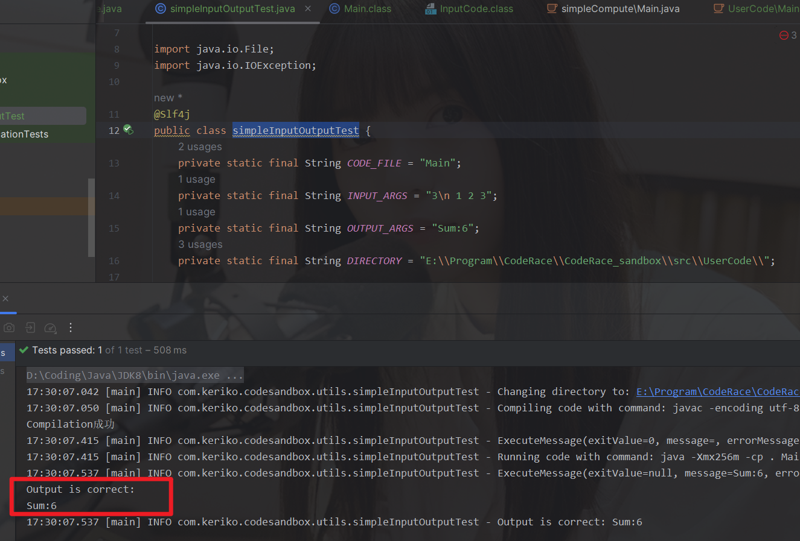

# CodeRace
在线判题系统是一个面向编程爱好者和专业人士的代码测试平台，支持多语言编程环境，提供即时反馈和代码评估服务。旨在促进编程教育和技能提升，同时搭建交流与学习的平台。

项目前端来源: [WAICoder](https://github.com/aaaaa-pi/WAICoder)

## 项目完成情况

- [ ] C++（？），python，Golang判题机实现
- [ ] 核心代码模式拼接
- [ ] 传统输入模式代码修改
- [ ] 用户题目完成状态
- [ ] 管理员用户信息管理
- [ ] 排行榜
- [ ] AI题解及代码优化建议
- [ ] 发布评论
- [ ] 题解查看
- [ ] 评论信息查看（markdown）
- [x] 未登录题目预览
- [x] 随机一题接口实现
- [x] Header用户信息获取
- [x] 主题切换按钮重新封装
- [x] 题目状态信息优化
- [x] 添加查询题目

- [x] 用户信息修改

- [x] 登录注册功能

# 项目需求分析


# 开发日志

## 数据库表项设计


 # 重点功能实现

## 1. 多模式兼容

- **ACM 模式**：传统的输入输出模式，要求选手编写完整的程序，读取标准输入（如 `System.in` 或 `Scanner`），并将结果输出到标准输出（如 `System.out`）。

- **核心代码模式**：选手只需实现核心逻辑，例如编写一个特定的函数，输入参数通过方法参数传递，输出通过返回值给出。

  问题：核心代码方便刷题，对于一些模拟操作，强输入要求，格式化输出等方面表现欠佳。而ACM模式对于链表、树等稍微复杂的数据结构支持不是很好。

思考：对于同一题目的多模式兼容是不现实的。有的题目会在一个输入示例中给出多轮数据，这种情况显然不适合核心代码模式。

解决思路：1. 限制题目，规定题目尽量按照核心代码模式的思路。（不可取）

2. 🌟每道题目由创建者选择使用那种模式。（常用，选择）（ACM，核心，通用）
3. 只为核心代码模式添加输入逻辑，用做题用户自行打印输出。

具体方案：

可以使用一个包装器（wrapper）来调用选手的核心函数，并将数据从标准输入转换为函数参数。

对于两数之和问题，ACM模式的用户代码如下。

```java
public class Main {
    public static void main(String[] args) {
        Scanner scanner = new Scanner(System.in);
        int a = scanner.nextInt();
        int b = scanner.nextInt();
        System.out.println(a + b);
    }
}
```

核心代码如下：

```java
public class Solution {
    public void add(int a, int b) {
       return a + b;
    }
}
```

实现流程：

**解析输入**：对于 ACM 模式，直接从标准输入读取；对于核心代码模式，从输入数据中解析函数参数。

**执行选手代码**：

- **ACM 模式**：直接运行选手提交的代码。
- **核心代码模式**：运行包装器代码，包装器代码内部调用选手的核心逻辑函数。

**比对输出**：无论哪种模式，最终的输出都应与标准输出格式进行对比，以判断答案是否正确。


为了处理 ACM 模式中的用户自定义变量和方法，我们要确保包装器代码不会与用户代码发生冲突。以下是一些具体的策略：

- **使用特定的命名空间**：包装器类使用一个与用户代码不同的类名（如 `Main`），而不是与用户的 `Solution` 类重名。
- **核心函数调用隔离**：包装器只负责读取输入和调用核心逻辑函数（如 `add`），而不访问用户定义的任何其他变量或方法。只调用预定义签名的方法。
- **限定核心代码实现范围**：OJ 系统可以限制用户在核心代码模式下只能修改 `Solution` 类及其方法定义，保证系统自动生成的包装器不会和用户的自定义内容冲突。

**代码包装器的伪代码如下：**

```python
def generate_wrapper(problem_definition):
    # 获取题目的函数签名
    function_signature = problem_definition["function_signature"]
    input_handling_code = problem_definition["input_handling_code"]
    output_format = problem_definition["output_format"]

    # 生成包装器代码的模板
    wrapper_code_template = f"""
    import java.util.Scanner;

    public class Main {{
        public static void main(String[] args) {{
            {input_handling_code}

            // 调用用户的核心代码
            Solution solution = new Solution();
            {function_signature}

            System.out.println("{output_format}");
        }}
    }}
    """
    return wrapper_code_template

```

这样核心代码模式和ACM模式的选择权交在题目创建者手上。用创建者关系代码的输入、输出等前后处理。

根据上述描述，若要修改兼容模式，需要在题目信息表添加字段：

| judgeType          | functionSignature                             | inputHandlingCode                                       | outputFormat                                            |
| ------------------ | --------------------------------------------- | ------------------------------------------------------- | ------------------------------------------------------- |
| acm, core, general | {"java":"add(int a int b)","cpp"........... } | {"java":"int a = scanner.nextInt();","cpp"........... } | {"java":"int a = scanner.nextInt();","cpp"........... } |

在包装器包装之后，就统一成ACM模式了，由系统负责输入输出。

PS. 理论上包装器可以直接完成判题工作，让代码沙箱只返回True， false

## 2. 判题服务流程


## 3. Java原生代码沙箱

核心实现思路：用程序代替人工，用程序来操作命令行，去编译执行代码

Java 进程执行管理类  Process

```
1.把用户的代码保存为文件
2.编译代码，得到 class文件
3.执行代码，得到输出结果
4.收集整理输出结果
5.文件清理，释放空间
6.错误处理，提升程序健壮性
```

Java 编译执行流程

```shell
 javac -encoding utf-8 .\Main.java
 java -cp . Main 1 2
```

Java与控制台交互 `重要`

```java
package com.keriko.codesandbox.utils;

import cn.hutool.core.util.StrUtil;
import com.keriko.codesandbox.model.ExecuteMessage;
import org.apache.commons.lang3.StringUtils;
import org.springframework.util.StopWatch;

import java.io.*;
import java.util.ArrayList;
import java.util.List;

/**
 * 进程工具类
 */
public class ProcessUtils {

    /**
     * 执行进程并获取信息
     *
     * @param runProcess
     * @param opName
     * @return
     */
    public static ExecuteMessage runProcessAndGetMessage(Process runProcess, String opName) {
        ExecuteMessage executeMessage = new ExecuteMessage();

        try {
            StopWatch stopWatch = new StopWatch();
            stopWatch.start();
            // 等待程序执行，获取错误码
            int exitValue = runProcess.waitFor();
            executeMessage.setExitValue(exitValue);
            // 正常退出
            if (exitValue == 0) {
                System.out.println(opName + "成功");
                // 分批获取进程的正常输出
                BufferedReader bufferedReader = new BufferedReader(new InputStreamReader(runProcess.getInputStream()));
                List<String> outputStrList = new ArrayList<>();
                // 逐行读取
                String compileOutputLine;
                while ((compileOutputLine = bufferedReader.readLine()) != null) {
                    outputStrList.add(compileOutputLine);
                }
                executeMessage.setMessage(StringUtils.join(outputStrList, "\n"));
            } else {
                // 异常退出
                System.out.println(opName + "失败，错误码： " + exitValue);
                // 分批获取进程的正常输出
                BufferedReader bufferedReader = new BufferedReader(new InputStreamReader(runProcess.getInputStream()));
                List<String> outputStrList = new ArrayList<>();
                // 逐行读取
                String compileOutputLine;
                while ((compileOutputLine = bufferedReader.readLine()) != null) {
                    outputStrList.add(compileOutputLine);
                }
                executeMessage.setMessage(StringUtils.join(outputStrList, "\n"));

                // 分批获取进程的错误输出
                BufferedReader errorBufferedReader = new BufferedReader(new InputStreamReader(runProcess.getErrorStream()));
                // 逐行读取
                List<String> errorOutputStrList = new ArrayList<>();
                // 逐行读取
                String errorCompileOutputLine;
                while ((errorCompileOutputLine = errorBufferedReader.readLine()) != null) {
                    errorOutputStrList.add(errorCompileOutputLine);
                }
                executeMessage.setErrorMessage(StringUtils.join(errorOutputStrList, "\n"));
            }
            stopWatch.stop();
            executeMessage.setTime(stopWatch.getLastTaskTimeMillis());
        } catch (Exception e) {
            e.printStackTrace();
        }
        return executeMessage;
    }

    /**
     * 执行交互式进程并获取信息
     *
     * @param runProcess
     * @param args
     * @return
     */
    public static ExecuteMessage runInteractProcessAndGetMessage(Process runProcess, String args) {
        ExecuteMessage executeMessage = new ExecuteMessage();

        try {
            // 向控制台输入程序
            OutputStream outputStream = runProcess.getOutputStream();
            OutputStreamWriter outputStreamWriter = new OutputStreamWriter(outputStream);
            String[] s = args.split(" ");
            String join = StrUtil.join("\n", s) + "\n";
            outputStreamWriter.write(join);
            // 相当于按了回车，执行输入的发送
            outputStreamWriter.flush();

            // 分批获取进程的正常输出
            InputStream inputStream = runProcess.getInputStream();
            BufferedReader bufferedReader = new BufferedReader(new InputStreamReader(inputStream));
            StringBuilder compileOutputStringBuilder = new StringBuilder();
            // 逐行读取
            String compileOutputLine;
            while ((compileOutputLine = bufferedReader.readLine()) != null) {
                compileOutputStringBuilder.append(compileOutputLine);
            }
            executeMessage.setMessage(compileOutputStringBuilder.toString());
            // 记得资源的释放，否则会卡死
            outputStreamWriter.close();
            outputStream.close();
            inputStream.close();
            runProcess.destroy();
        } catch (Exception e) {
            e.printStackTrace();
        }
        return executeMessage;
    }
}

```

简单测试一下，跑通代码沙箱流程

```java
//Main.java
import java.util.*;

public class Main
{
    public static void main(String[] args)
    {
        Scanner scanner = new Scanner(System.in);
        int n = scanner.nextInt();
        int sum = 0;
        for (int i = 0; i < n; i++) {
            sum  += scanner.nextInt();
        }
        System.out.println("Sum:" + sum);
    }
}
```

```java
//simpleInputOutputTest.java
package com.keriko.codesandbox.utils;

import com.keriko.codesandbox.model.ExecuteMessage;
import com.keriko.codesandbox.utils.ProcessUtils;
import lombok.extern.slf4j.Slf4j;
import org.junit.jupiter.api.Test;

import java.io.File;
import java.io.IOException;

import static org.junit.jupiter.api.Assertions.assertEquals;

@Slf4j
public class simpleInputOutputTest {
    private static final String CODE_FILE = "Main";
    private static final String INPUT_ARGS = "3\n 1 2 3";
    private static final String OUTPUT_ARGS = "Sum:6";
    private static final String DIRECTORY = "E:\\Program\\CodeRace\\CodeRace_sandbox\\src\\UserCode\\";

    @Test
    public void test() {
        try {
            // Change directory
            changeDirectory(DIRECTORY);

            // Compile the code
            compileCode(CODE_FILE);

            // Run the code
            String output = runCode(CODE_FILE);

            // Validate output
            validateOutput(output, OUTPUT_ARGS);

        } catch (IOException e) {
            log.error("IO exception occurred: ", e);
        } catch (InterruptedException e) {
            log.error("Process was interrupted: ", e);
        }
    }

    /**
     * 改变工作目录
     *
     * 通过启动外部命令行工具来改变当前工作目录此方法使用ProcessBuilder来构建并启动命令行进程，以便改变目录
     *
     * @param directory 要改变到的新目录路径
     * @throws IOException 如果构建或启动进程时发生错误
     */
    private void changeDirectory(String directory) throws IOException {
        // 记录要改变的目录路径
        log.info("Changing directory to: {}", directory);

        // 创建ProcessBuilder实例，参数为cmd.exe命令行工具，用于改变目录
        // 只适用于在Windows下测试
        ProcessBuilder cdProcessBuilder = new ProcessBuilder("cmd.exe", "/c", "cd", directory);

        // 设置ProcessBuilder的工作目录为要改变到的新目录
        cdProcessBuilder.directory(new File(directory));

        // 启动命令行进程以执行目录改变操作
        cdProcessBuilder.start();
    }

    /**
     * 编译给定代码文件的Java代码
     *
     * @param codeFile 代码文件名（不包括扩展名）, 用于构造编译命令
     * @throws IOException 如果创建或执行进程时发生IO错误
     * @throws InterruptedException 如果在等待进程执行时线程被中断
     */
    private void compileCode(String codeFile) throws IOException, InterruptedException {
        // 构造编译命令，使用utf-8编码来确保中文代码文件可以被正确编译
        String compileCmd = String.format("javac -encoding utf-8 %s.java", codeFile);
        log.info("Compiling code with command: {}", compileCmd);

        // 使用ProcessBuilder来构建编译命令的执行环境
        ProcessBuilder compileProcessBuilder = new ProcessBuilder("cmd.exe", "/c", compileCmd);
        // 设置编译命令的执行目录为系统指定的临时目录
        compileProcessBuilder.directory(new File(DIRECTORY));
        // 启动编译进程
        Process compileProcess = compileProcessBuilder.start();

        // 运行编译进程并获取输出信息
        ExecuteMessage compileMessage = ProcessUtils.runProcessAndGetMessage(compileProcess, "Compilation");
        // 记录编译信息
        log.info(compileMessage.toString());
    }

    /**
     * 运行给定的Java代码文件
     *
     * 该方法使用指定的类路径和内存限制通过cmd.exe来执行Java代码它还记录了运行命令，
     * 并在执行过程中与进程交互，获取并记录输出信息
     *
     * @param codeFile 要运行的Java代码文件名
     * @return 运行后获取的消息字符串
     * @throws IOException 当创建或启动进程时发生IO错误
     * @throws InterruptedException 当线程被中断时
     */
    private String runCode(String codeFile) throws IOException, InterruptedException {
        // 格式化命令行命令，指定Java运行时的最大堆内存为256m，并指定类路径为当前目录，
        // 准备运行的类名为codeFile参数
        String runCmd = String.format("java -Xmx256m -cp . %s", codeFile);
        // 记录即将执行的命令
        log.info("Running code with command: {}", runCmd);

        // 创建ProcessBuilder实例，使用cmd.exe来执行格式化后的Java命令
        // 使用cmd.exe /c 来在Windows命令提示符下执行命令
        ProcessBuilder runProcessBuilder = new ProcessBuilder("cmd.exe", "/c", runCmd);
        // 设置进程的执行目录为代码中的DIRECTORY常量指定的目录
        runProcessBuilder.directory(new File(DIRECTORY));
        // 启动进程
        Process runProcess = runProcessBuilder.start();

        // 使用工具类ProcessUtils运行进程并与之交互，获取进程的输出信息
        // INPUT_ARGS为与进程交互的输入参数
        ExecuteMessage runMessage = ProcessUtils.runInteractProcessAndGetMessage(runProcess, INPUT_ARGS);
        // 记录进程的输出信息
        log.info(runMessage.toString());
        // 返回进程的输出消息
        return runMessage.getMessage();
    }

    @Test
    private void validateOutput(String actualOutput, String expectedOutput) {
        if (!actualOutput.equals(expectedOutput)) {
            log.error("Output is incorrect. Expected: {} but got: {}", expectedOutput, actualOutput);
        } else {
            System.out.println("Output is correct: \n" + actualOutput);
            log.info("Output is correct: {}", actualOutput);
        }
        // 断言验证
        assertEquals(expectedOutput, actualOutput);
    }
}
```



踩坑点：
自行编译的代码文件不能放到main，test等包内。加了package就无法找到主类。

测试代码文件尽量叫`Main.java`
